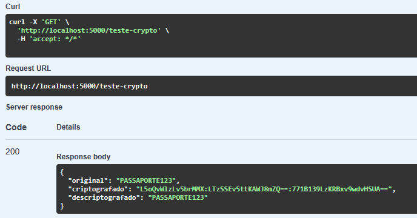

# SpaceCare Security Edition

API .NET para monitoramento de saúde em turismo espacial com foco na proteção de dados médicos através de criptografia AES-256-GCM.

---

# Contexto do Projeto

Este repositório é uma evolução (*fork*) do projeto original **SpaceCare**, desenvolvido para a disciplina de Engenharia de Software.

Enquanto a versão original tinha foco na construção da API, persistência em Oracle Database e integração com telemetria IoT e IoB, esta versão foi criada para a disciplina de **Cibersegurança**, concentrando-se exclusivamente na implementação e validação de mecanismos de proteção de dados sensíveis.

---

# Arquitetura

```text
SpaceCare/
├── Controllers/
├── Domain/
├── Services/
├── Infra/
├── Migrations/
├── Docs/Images/
├── Program.cs
└── README.md
```

### Principais Tecnologias

* ASP.NET Core (.NET)
* Entity Framework Core
* Oracle Database
* Arquitetura em Camadas
* DTOs e Records
* Dependency Injection
* Middleware Global de Exceções

---

# Segurança Implementada

## MedicalCryptoService

A camada de segurança foi implementada através do `MedicalCryptoService`, responsável pela criptografia e descriptografia de dados médicos.

### Características

* AES-256-GCM
* Nonce de 96 bits
* Authentication Tag de 128 bits
* Geração criptograficamente segura de Nonces
* Chaves carregadas por configuração ou variável de ambiente

O formato do dado protegido é:

```text
BASE64_NONCE:BASE64_CIPHERTEXT:BASE64_TAG
```

Exemplo:

```text
vSLEiiV3gjWUt8hy:mHYh2JZjjV1aeA3E1Q==:E9Zw2M41c7Z/GIoOM39WkQ==
```

---

# Demonstração de Segurança

Foi criado um endpoint específico para validar o funcionamento completo da criptografia implementada no sistema.

## Endpoint

```http
GET /teste-crypto
```

## Teste via Swagger

1. Executar a aplicação:

```bash
dotnet run
```

2. Abrir a interface Swagger:

```text
https://localhost:<porta>/swagger
```

3. Executar o endpoint:

```http
GET /teste-crypto
```

4. Resultado obtido:




## O que a demonstração comprova

* Criptografia AES-256-GCM funcional;
* Geração de Nonce aleatório;
* Geração de Authentication Tag;
* Confidencialidade dos dados;
* Integridade da informação protegida;
* Recuperação correta do valor original após a descriptografia.


---

# Como Executar

## Configurar Banco Oracle

```json
{
  "ConnectionStrings": {
    "OracleConnection": "Data Source=SERVIDOR;User Id=USUARIO;Password=SENHA;"
  }
}
```

## Configurar Chave AES

```json
{
  "Crypto": {
    "AesKey": "CHAVE_HEXADECIMAL_256_BITS"
  }
}
```

## Executar

```bash
dotnet restore
dotnet ef database update
dotnet run
```

---

# Integrantes — 3ESPG

* João Victor Soave (RM557595)
* Maria Alice Freitas Araújo (RM557516)
* Pedro Henrique Mendes dos Santos (RM555332)
* Rafael Teofilo Lucena (RM555600)
* Vinicius Fernandes Tavares Bittencourt (RM558909)

---

# Conclusão

Esta versão do SpaceCare demonstra a aplicação prática de criptografia autenticada AES-256-GCM para proteção de dados médicos em um ambiente de turismo espacial, validando conceitos fundamentais de confidencialidade, integridade e autenticação exigidos em sistemas críticos.
